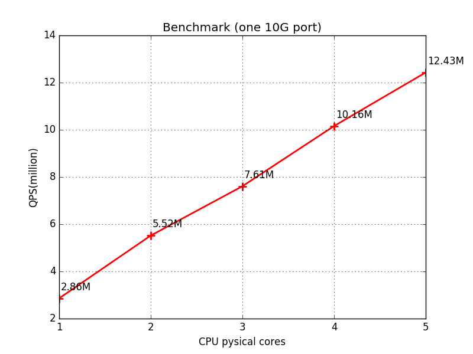
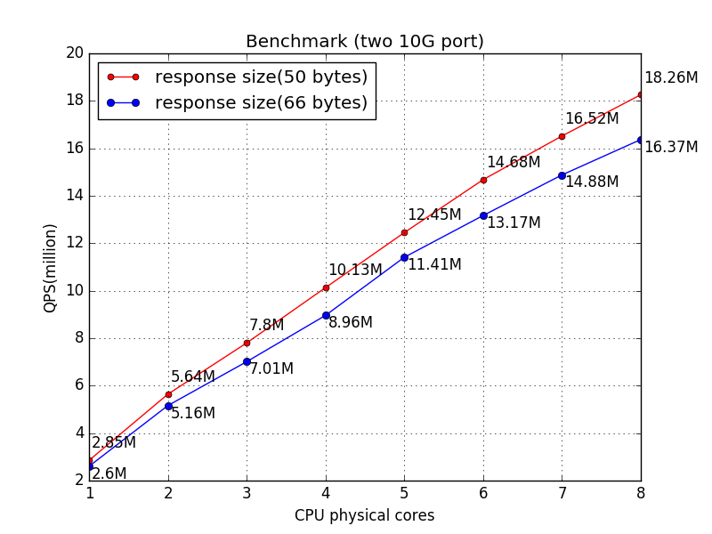

# SHUKE

A high performance authority-only dns server implemented with DPDK

## Features
1. support storing zone data in mongodb
2. high performance

## performance
### test environment

    NIC:  Intel Corporation 82599ES 10-Gigabit SFI/SFP+ Network Connection
    CPU: Intel(R) Xeon(R) CPU E5-2650 0 @ 2.00GHz
    Memory: 64GB
    OS:  Ubuntu 16.04.1 LTS
    Kernel: 4.4.0-81-generic

### result

1. one 10G port

    

   pls note when test with 5 cores, shuke actually processed 12.43M and 11.39M requests per second,
   but the client reports 10.7M and 9.46M, this is because the NIC doesn't have enough bandwidth.

2. two 10G port

    

## Quick start
### vagrant
if you use vagrant, it is very simple to try shuke
1. install virtualbox and vagrant
2. run `cd vagrant && vagrant up`
3. ssh to the guest machine, then run the following command:

       cd /shuke
       sudo build/shuke-server -c vagrant/test.toml

4. in the host machine, run `dig www1.example.com. @172.28.128.10 -p 19899 -t A`

**tips**: `vagrant/setup.sh` is a good place to figure out how to build this project
and prepare the running environment.
### buid

1. build dpdk, shuke is only tested on dpdk-17.05.1. if you use linux x86-64,
   you can run `bash 3rd/dpdk-stable-<version>/usertools/dpdk-setup.sh`,
   then perform the following
   instructions.
    + press `[12]` to compile dpdk for linux x86-64 target.
    + press `[15]` to insert UIO
    + press `[17]` to insert KNI
    + press `[19]`(`[18]` for non-NUMA systems) to setup huge pages,
      since shuke uses huge page heavily, so allocate as large as possible
    + press `[21]` to bind NIC device
    + press `[32]` to quit

2. install autoconf and libtool
3. run `make` at the top of source tree, then you will get a binary file named `build/shuke-server`.

### tips
1. if you want to build shuke in DEBUG mode, just run `make DEBUG=1`
2. if you want to see the compiler command, just run `make V=1`
3. if you want to support ip fragmentation, just run `make IP_FRAG=1`.

### run
just run `build/shuke-server -c conf/shuke.toml`,
you may need to change the config in the config file.

## mongo data schema
every zone should have a collection in mongodb. you can use
`tools/zone2mongo.py` to convert zone data from zone file to mongodb

### zone collection
this collection used to track the RR of a zone,
the collection name is the domain of the zone, since mongodb's
collection name can't end with dot, so the domain should be the
absolute domain name except the last dot.
the collection should contain the following fields

    {
        name: "the absulute owner name,
        ttl: 1234567,
        type: "DNS type",
        rdata: "rdata"
    }

the meaning of fields is clear. just like the zone file.

## Admin Commands
SHUKE has a tcp server used to execute admin operations,
`tools/admin.py` is the client. it supports several commands:

1. `zone`: this command used to manipulate the zone data in memory, it has many subcommands.
    1. `get`: get a zone
    2. `getall`: get all zones
    3. `reload`: reload  multiple zone
    4. `reloadall`: reload all zone
    5. `get_numzones`: return the number of zones in memory cache.
2. `config`: this command is used to manipulate the config of server.
3. `version`: return version of shuke
4. `debug`: mainly for debug
    1. `segfault`: cause a segement fault
    2. `oom`: trigger a OOM error.
5. `info`: print information of server, including statistics. subcommands
    1. `all` or `default` or empty: return all information
    2. `server`: return the server information
    3. `memory`: return memory usage information
    4. `cpu`: return cpu usage information
    5. `stats`: statistics information

## TODO
1. support EDNS, DNSSEC and PTR (currently only support A,AAAA,NS,CNAME,SOA,SRV,TXT,MX.).
2. support mysql (currently only support mongodb).
3. plugin system
